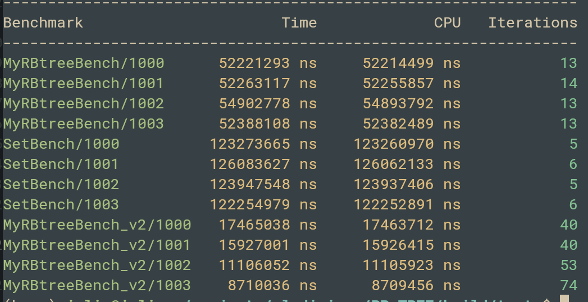
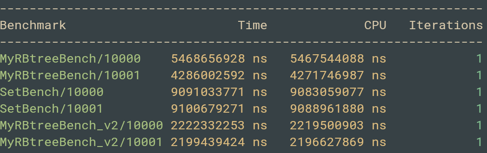

## Red-Black Tree
Here is the implementation of Red-Black Tree in C++ and comparison to the set using the example of the range queries problem.
### Installation
To test program [googletest](https://github.com/google/googletest) is used and for benchmarking [googlebenchmark](https://github.com/google/benchmark) respectively.
```shell script
cmake -S . -B build -D CMAKE_BUILD_TYPE=Release
cmake --build build
```
Then, to run range queries
```shell script
./build/src/main
```
To run tests
```shell script
./build/tests/test <file_with_data> <file_with_answers>
```
To run benchmark
```shell script
./build/tests/BenchMarks
```
### Red-Black Tree and set comparison
Specifically for range queries problem I implemented method count that counts node keys in tree from the given range. In benchmark I compared that method with just a loop of find in that range and with set. Here are benchmark results:




